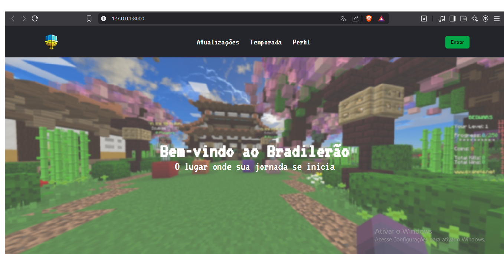
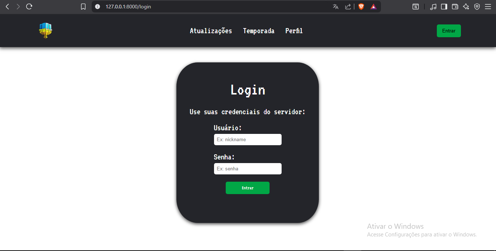
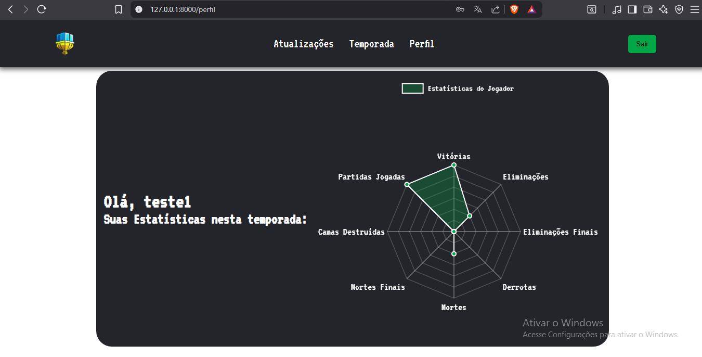

# Bradilerao

O projeto **Bradilerao** foi desenvolvido com fins educacionais, com o objetivo de explorar e aplicar conceitos do framework Laravel em um ambiente prático. A aplicação foi pensada para facilitar a visualização de estatísticas individuais de um jogador de Minecraft. Utilizando ferramentas modernas de desenvolvimento web, o sistema organiza os dados do jogador de forma clara e acessível.

## 🛠 Tecnologias utilizadas

 
 
 
 
 
 
 


## ⚙️ Como rodar o projeto localmente

1. Clone este repositório:
```bash
git clone https://github.com/candidohenrique/bradilerao.git  

cd bradilerao
```

2. Instale as dependências PHP:
```bash
composer install
```

3. Inicie o servidor local:
```bash
  php artisan serve
```

4. Acesse http://localhost:8000 no navegador.

## 🎯 Funcionalidades principais

- Visualização das estatísticas individuais de um player de Minecraft em um servidor.
- Interface simples e organizada para visualização.
- Utilização de gráficos para apresentar dados de forma visual e intuitiva.
- Sistema de login utilizando o usuário e senha do servidor de Minecraft.

## 📸 Demonstração







## 🤝 Contribuição

### Contribuições são bem-vindas! Para contribuir:

1. Faça um fork deste repositório.
2. Crie uma branch com a sua feature: `git checkout -b minha-feature`.
3. Faça commit das suas alterações: `git commit -m 'Adiciona nova feature'`.
4. Envie para o seu fork: `git push origin minha-feature`.
5. Abra um Pull Request aqui no repositório original.

## 📄 Licença

[MIT](https://choosealicense.com/licenses/mit/)